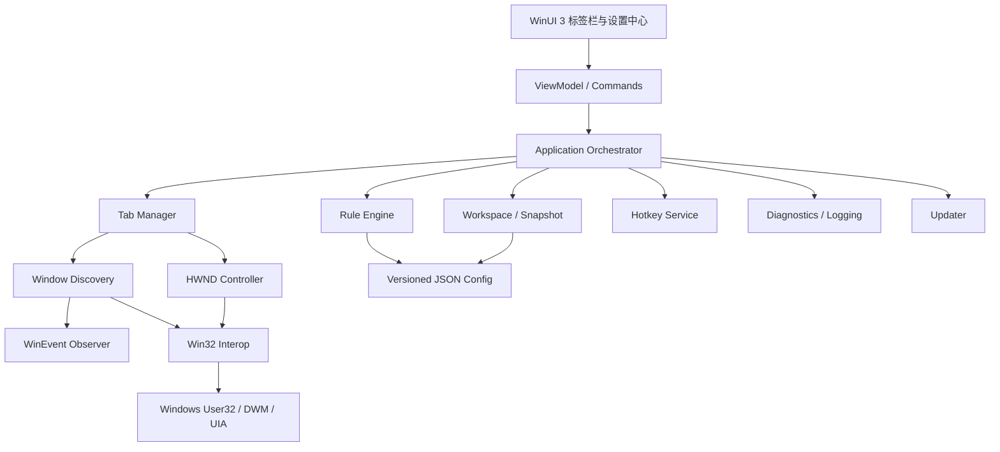
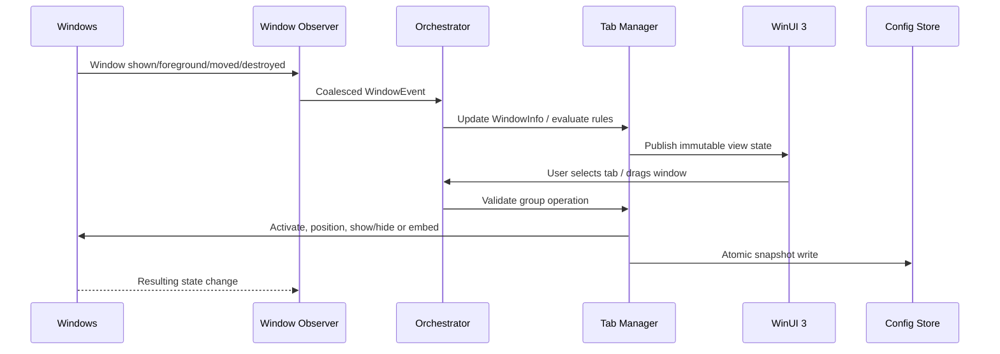

# TabNest项目开发计划书

> 文档版本：0.3（竞品取证修订稿）  
> 编制日期：2026-08-10，修订于 2026-08-11  
> 项目类型：Windows 桌面效率工具  
> 目标团队：1～2 名开发者，AI 辅助开发  
> 目标平台：Windows 11 优先，Windows 10 作为第二兼容目标  
> 评审结论：建议立项。技术路线已由 Groupy 2 二进制取证确定，不再需要"窗口承载技术 Spike"来猜测竞品实现。

---

## 0. 0.3 版修订说明

0.2 版中关于 Groupy 2 内部实现的判断均标注为"基于公开行为的工程推断"。**0.3 版对本机安装的 Groupy 2 v2.3.1 完成了二进制与运行时取证**，推断已被事实取代，其中数条被推翻。

完整取证报告见 [`docs/competitive-analysis.md`](docs/competitive-analysis.md)。核心修订：

| # | 0.2 版内容 | 0.3 版修订 | 涉及章节 |
|---|---|---|---|
| 1 | 「不能确认它是否以 `SetParent` 作为主要实现」 | **Groupy 不使用 `SetParent`**。它是"进程内接管标题栏非客户区绘制 + 进程外窗口重排"。把"像 Groupy 一样嵌入"等同于"`SetParent` 承载"的等式不成立 | §3.4、§6.4 |
| 2 | 原则三「**不做进程注入**」 | **原则重写**。Groupy 全部能力建立在通用注入之上（实测注入 46 个进程）。TabNest 改为分阶段：阶段一不注入，阶段二引入注入层，但用途边界严格收紧 | §2.4、§15.4 |
| 3 | 「标签在标题栏上方/集成承载的产品模式选择」列为 P0 | **删除该选择器**。集成承载必须进程内渲染，阶段一物理不可达。不做只能选一边的假单选框 | §8.4 |
| 4 | 任务栏仍显示多个成员，列为方案 B 的**固有缺陷** | **不必要的认输**。`ITaskbarList::DeleteTab`/`AddTab` 对任意进程顶层 HWND 有效且完全可逆，不注入也能实现"仅显示活动窗口按钮" | §6.5、§11.3 |
| 5 | 性能目标 <180MB / <1% CPU | **相对竞品是倒退**。Groupy 实测常驻 78MB / 0.08% 单核。目标全面重设 | §12.3 |
| 6 | 功能清单 | **遗漏 14 项**，其中「未分组窗口悬停浮出分组条」是 Groupy 的日常分组主入口，缺失则产品不可用 | §5.2、§8.4 |
| 7 | 焦点风险「缓解措施：激活顺序、焦点验证和重试」 | **根因明确**：Groupy 代码在目标进程内，天然持有前台权限，故无需 `AttachThreadInput`。TabNest 进程外必撞前台锁定，必须实现四级降级链 | §11.1、§6.7 |

技术栈相应调整：UI 由 WinUI 3 改为 **WPF**（设置中心，按需加载）+ **Win32/Direct2D**（常驻标签轨道）；打包由 MSIX 优先改为 **unpackaged 自包含**（本机无 Windows SDK，`makeappx`/`signtool` 不可用）。

---

## 1. 项目概述

### 1.1 项目背景

Windows 用户经常同时打开 IDE、终端、浏览器、文档、即时通讯和调试工具。Windows 任务栏虽然能够按应用合并按钮，但不能把不同应用窗口组织成一个可快速切换的工作上下文。用户只能依赖 Alt+Tab、虚拟桌面、任务栏或窗口平铺来管理这些窗口，导致：

- 同一项目的窗口散落在多个位置；
- Alt+Tab 列表被大量窗口占据；
- 多显示器场景下难以记住窗口所在屏幕；
- 从一个工作上下文切换到另一个上下文需要重复寻找窗口；
- 浏览器已有标签心智模型，却无法迁移到普通 Windows 应用。

TabNest 的目标，是提供一个面向 Windows 桌面的“窗口标签工作区”：将多个独立窗口组织到一个可见的标签集合中，支持快速切换、拖拽合并、拆分、规则化管理，并尽量保持原应用的原生输入、渲染和生命周期行为。

### 1.2 本次调研边界

本计划书结合了：

1. Stardock Groupy 2 官方产品页、发布说明、帮助中心和更新历史；
2. TidyTabs 官方功能资料；
3. Microsoft PowerToys FancyZones 的窗口观察与拖拽架构资料；
4. Apple macOS 官方窗口标签说明；
5. Microsoft Windows App SDK、WinUI 3、Win32、DWM、UI Automation 文档；
6. 本机环境检查：Windows 11 64 位，系统版本 10.0.26100；本机已安装并运行 Groupy 2，窗口枚举可发现“Stardock Groupy 2 设置”窗口。

本次未对 Groupy 2 进行进程注入、反汇编或内部实现提取；窗口截图和交互仅用于观察界面行为，不用于确认其内部实现。因此关于 Groupy 内部实现的结论仍均标为“基于公开行为的工程推断”，不能视为 Stardock 的实现确认。

### 1.3 本机 Groupy 2 实测记录（2026-08-10）

本次补充了对本机 Groupy 2 的实际启动、界面浏览、设置页展开、临时窗口测试和配置恢复。实测机为 Windows 11 10.0.26100 x64，Groupy 2 设置页显示版本 **2.31**。

观察到的实际界面结构：


- 左侧导航为“总览、标签外观、标签颜色、分组设置、分组规则、关于、购买 Groupy 2”；
- 总览页提供“放置标签页在上方”和“集成标签页”两种模式；
- 总览页还提供任务栏按钮显示全部、仅活动窗口或仅一个组合按钮三种策略；
- 标签外观页提供传统标签、圆形标签、背景条、标签/背景栏高度、标签可见性和高级选项；
- 标签颜色页提供主题色管理、活动/非活动标签颜色、Mica 背景、背景模糊色，以及是否应用到 Explorer/Notepad/Office 标签的选项；
- 分组设置页明确区分 Windows 11 Explorer/Notepad 原生标签的“替换”与“覆盖”策略；
- 分组规则页明确分为自动窗口分组、已保存分组、阻止/允许应用、自定义规则四块。

本机当前配置还显示：


- 自动分组列表中存在 `idea64.exe`；
- “仅允许指定应用在组中”处于启用状态，列表中只有 `idea64.exe`；
- 这说明 Groupy 的实际行为高度依赖本地规则和允许列表，不能只根据“软件已安装”判断某个窗口一定可分组。

我曾临时取消该允许列表，打开两个带有明确标题的 `cmd.exe` 测试窗口并进行标题栏拖拽尝试；测试结束后已恢复原来的允许列表，并关闭了测试窗口。该次 `cmd.exe` 拖拽没有形成可见的 Groupy 标签组，因此只能记录为“当前测试路径下的兼容性/交互失败信号”，不能据此断言 Groupy 不支持控制台窗口：合成鼠标拖拽与人工拖拽可能存在差异，且控制台窗口属于特殊窗口类型。

同时观察到 Windows 11 File Explorer 顶部已经呈现原生风格的标签栏和“+”入口。结合 Groupy 设置页中的“替换 Explorer/Notepad 原生标签”选项，TabNest 必须把“原生标签存在”作为窗口分类和兼容策略的一部分，而不是简单地再叠加一层标签栏。

### 1.4 项目目标

#### 产品目标

- 让用户可以把多个普通 Windows 窗口组织成标签组；
- 让标签切换、拖拽合并和拆分接近浏览器标签体验；
- 提供开发者友好的键盘操作、规则、诊断和兼容性反馈；
- 建立可持续迭代的本地优先产品，而不是只完成一次性 Demo。

#### 技术目标

- 使用 C# + WinUI 3 + Windows App SDK 构建现代 Fluent UI；
- 通过 C# P/Invoke 调用 Win32 能力完成窗口发现、位置、状态和输入协调；
- 将外部窗口的生命周期与 UI 状态解耦，所有跨进程动作可回滚；
- 对不兼容窗口提供明确的拒绝、降级和恢复机制；
- 在 MVP 阶段控制范围，使 1～2 人团队能在 1～3 个月内得到可用 Beta。

### 1.5 最终评审结论摘要

| 评审项 | 结论 | 处理建议 |
|---|---|---|
| 产品方向 | 有真实需求，但不是空白市场 | 以“本地优先、开发者效率、诊断透明、快捷键优先”形成差异化 |
| Groupy 竞品 | 成熟且具备明显先发优势 | 不追求首版功能数量，先解决信任、稳定性和工作流价值 |
| WinUI 3 | 适合自己的设置和标签 UI | 它不会自动解决外部 HWND 承载，必须保留独立 Win32 互操作层 |
| 真实窗口嵌入 | 可行但兼容成本很高 | 先做实验性适配，不能作为 MVP 唯一路径 |
| 虚拟聚合 | 可较快形成可用体验，但不是物理单窗口 | 作为 MVP 基线，允许后续对兼容应用升级为嵌入模式 |
| MVP 范围 | 原始设想偏大 | P0 只做手动分组、标签切换、拆分、基础规则和恢复 |
| 商业价值 | 面向开发者和高级用户有机会 | 核心循环免费，Pro 主要售卖自动化、工作区、企业部署和支持 |

---

## 2. 产品定位

### 2.1 产品定义

TabNest 是一款 Windows 窗口标签管理工具。它不替代浏览器标签，也不试图重新实现窗口平铺，而是将“窗口级上下文切换”变成“标签级上下文切换”。

一句话定位：

> TabNest：把散落在 Windows 桌面上的工作窗口，收进可控、可恢复、可键盘操作的标签工作区。

### 2.2 目标用户

| 用户 | 典型场景 | 主要痛点 | 需要的能力 |
|---|---|---|---|
| 程序员 | IDE、终端、浏览器、数据库工具并行 | 同一项目窗口太多 | 项目组、快捷键、窗口标题识别、恢复 |
| 软件开发者 | VS、IDEA、VS Code、调试器和文档 | 窗口切换打断思路 | 键盘切换、拖拽分组、兼容性诊断 |
| 产品经理 | 原型、浏览器、文档、会议工具 | 按项目组织窗口困难 | 保存工作区、启动组、颜色标记 |
| 办公用户 | Word、Excel、PDF、邮件、文件夹 | 任务栏和 Alt+Tab 混乱 | 简单分组、低干扰标签栏 |
| 高级 Windows 用户 | 多屏、虚拟桌面、终端、管理工具 | 系统窗口管理能力碎片化 | 规则、脚本接口、隐私和可观测性 |

### 2.3 核心价值

用户需要 TabNest 的理由：


- 窗口标签比任务栏图标更能表达“同一工作上下文”；
- 标签切换更适合高频、短距离的上下文切换；
- 保存工作区可以把“正在工作的窗口集合”变成可复用资产；
- 规则与颜色能降低误操作和信息泄露风险；
- 本地优先方案不要求把窗口标题、文件名或工作内容上传到云端。

用户可能不选择 Groupy 2 的理由：


- 希望使用免费或开源方案；
- 不希望绑定账号、授权或遥测；
- 需要更适合开发者的快捷键、诊断和脚本能力；
- 希望清楚知道某个窗口为什么被分组、为什么不兼容；
- 需要中文优先、社区驱动或更快的功能迭代；
- 对成熟软件的旧式设置、视觉风格或兼容性行为不满意。

这不是说 Groupy 2 的产品价值不足。Groupy 2 已经在“通用窗口标签”上建立了成熟预期，TabNest 必须通过更透明、更稳定、更贴近开发者工作流来争取用户。

### 2.4 产品原则

1. **用户明确意图优先**：自动分组默认谨慎，任何可能隐藏或移动窗口的动作都要可撤销。
2. **窗口状态可恢复**：分组、拆分、崩溃、应用退出后，必须尽可能恢复窗口原位置和显示状态。
3. **不破坏原应用**（0.3 版重写）：可以注入渲染与事件代理层，但**绝不修改目标应用文件、绝不改变其业务行为、绝不阻塞其 UI 线程**；注入层必须随时可安全卸载并完全还原。
4. **兼容性透明**：不兼容时给出原因、建议和日志，而不是静默失败。
5. **本地优先**：默认不上传窗口标题、进程路径和工作区内容。
6. **键鼠并重**：鼠标拖拽体现直觉，快捷键体现效率。

> **关于原则三的修订**：0.2 版写的是"不做进程注入"。取证表明 Groupy 的全部核心能力（集成标签、原生标签替换、进程内焦点特权）都建立在通用注入之上——实测其 hook DLL 被映射进本机 46 个进程。若坚持不注入，这些功能物理上不可达，产品能力天花板将由该原则单方面决定。
>
> 因此把原则的约束对象从"是否注入"改为"注入后做什么"：**能力放开，用途收紧**。TabNest 阶段一仍完全不注入，阶段二引入注入层时受下述铁律约束。

#### 注入层铁律（阶段二强制，违反即视为缺陷）

1. **渲染与命中测试完全自治**。hook DLL 从共享内存读取标签快照自行绘制，绝不在绘制路径上跨进程请求数据——否则会把一次跨进程往返塞进目标程序的绘制路径。
2. **绝不阻塞目标 UI 线程**。只用 `PostMessage` 与无锁共享内存；禁止向 TabNest 进程 `SendMessage`，禁止在目标 UI 线程上同步读管道。**TabNest 卡死不得连累任何目标程序**——这是此类软件最致命的失败模式。
3. **体积最小化**。DLL 会映射进 40～50 个进程，每 1KB 乘以 50。禁用 C++ 异常与 RTTI，不静态链接臃肿 CRT，尽量纯 Win32（对标 Groupy 的 1.1MB，目标 ≤800KB）。

### 2.5 开源、免费、Pro 与企业版策略

| 版本 | 建议内容 | 目的 |
|---|---|---|
| Community / Open Source | 窗口模型、规则模型、基础分组逻辑、配置格式、诊断接口和部分 UI；本地运行；公开 issue | 建立信任、吸引贡献者和兼容性反馈 |
| Free | 手动分组、标签切换、拆分、基础设置、有限工作区、基础日志 | 让用户体验完整核心循环，降低试用门槛 |
| Pro | 无限工作区、自动规则、启动组、多显示器增强、窗口标题/图标策略、历史恢复、脚本/命令行、优先支持 | 对高频用户和专业开发者收费 |
| Enterprise | MSI/MSIX 或企业安装包、离线授权、集中配置、策略锁定、审计可选、长期支持、部署文档 | 面向 IT、研发团队和受管控环境 |

建议不要在最初版本限制“每组只能有几个标签”这类核心能力，否则会直接损害产品口碑。商业化应集中在自动化、工作区、部署、支持和团队治理，而不是人为破坏核心体验。

### 2.6 关键成功指标

Beta 阶段建议追踪本地匿名指标或完全本地诊断，不强制上传：

- 首次安装后 10 分钟内成功完成一次分组的用户比例；
- 手动分组成功率 ≥ 95%；
- 标签切换 P95 ≤ 150ms（目标应用正常响应时）；
- 发生异常后能自动恢复或提供恢复入口的比例 ≥ 95%；
- 7 日内仍使用标签组的 Beta 用户比例；
- 兼容性问题中有明确可复现步骤的比例；
- 用户主动关闭自动分组的比例，作为规则体验的反向指标。

---

## 3. Groupy 2竞品分析

### 3.1 Groupy 2 产品定位

Stardock 将 Groupy 2 定位为面向 Windows 10/11 的通用标签体验：把多个应用和文档拖拽到一起，组合为带标签的单一窗口；同时提供自动分组、保存的 Groupings、颜色 Accents、多个标签样式，并支持面向企业的部署和许可证管理。[Groupy 2 官方产品页](https://www.stardock.com/products/groupy/)

官方发布说明还明确提到：Groupy 2 支持把应用和文档拖拽到一起、将应用组保存到任务栏并一次启动、对标签添加颜色，以及与 Windows 11 风格和 File Explorer 集成。[Groupy 2 发布说明](https://www.stardock.com/press/software/groupy/documents/Groupy_2_1.0_Press_Release.pdf)

### 3.2 Groupy 2核心功能列表

| 功能 | 说明 | TabNest 的启示 |
|---|---|---|
| 通用标签 | 在近似任意 Windows 应用上提供标签 | 兼容性是核心产品能力，不是附加项 |
| 手动拖拽分组 | 将窗口拖到另一个窗口的标题栏或标签区域 | 拖拽目标、延迟、修饰键和撤销必须可配置 |
| 自动分组 | 可按相同应用或规则自动合并 | 自动化必须可解释、可排除、可回滚 |
| 标签切换 | 点击标签激活不同窗口 | 激活、焦点、Z 序和窗口状态需统一处理 |
| 标签拆分 | 将标签拖离组或通过菜单单独恢复 | 拆分是安全阀，必须和分组同等重要 |
| Groupings | 保存一组应用并从任务栏启动 | TabNest 可发展为“工作区” |
| Accents | 用颜色按任务、项目或类型标记 | 颜色应服务于识别，不应成为装饰负担 |
| 标签样式 | 传统、圆角、背景栏、标题栏整合等 | 视觉个性化放在 P1/P2，不能抢占稳定性资源 |
| 标签预览 | 悬停查看非活动标签的预览 | 预览可能增加 DWM 和性能复杂度，后置 |
| File Explorer/原生标签处理 | 可配置替换或保留 Windows 11 原生标签 | 必须识别原生标签应用，避免双重标签 |
| 企业部署 | 静默安装、许可证和部署工具 | 企业版可作为长期收入来源 |

### 3.3 Groupy 2交互设计特点

根据官方帮助中心资料，Groupy 2 对分组动作提供了较细的控制：可以选择拖到标题栏时立即分组，或经过约 1/3 秒、2/3 秒、1 秒延迟后分组，也可以要求 Shift、Ctrl 或鼠标按钮作为修饰键；还可以限制只允许同一应用分组。[Groupy 2 Grouping Settings](https://stardock.atlassian.net/wiki/spaces/SHC/pages/1486913552/Groupy%2B2%2BUI%2BGrouping%2BSettings)

标签外观方面，它提供传统/圆角样式、背景栏高度、激活窗口显示方式、最大化时隐藏、关闭按钮策略、图标显示、标题栏文字隐藏和悬停预览等选项。[Groupy 2 Tab Appearance](https://stardock.atlassian.net/wiki/spaces/SHC/pages/1486946305/Groupy%2B2%2BUI%2BTab%2BAppearance)

规则方面，Groupy 2 可以按进程、窗口类、标题文本，以及 Office 文件或 File Explorer 文件夹匹配；还支持允许/阻止应用和保存组。[Groupy 2 Grouping Rules](https://stardock.atlassian.net/wiki/spaces/SHC/pages/1486520345/Groupy%2B2%2BUI%2BGrouping%2BRules)

交互设计的可取之处：


- 直接操作窗口，不要求用户先打开一个独立管理器；
- 标签位置与窗口标题栏建立稳定空间关系；
- 拖拽、拆分和保存组形成闭环；
- 自动行为提供白名单、黑名单和修饰键保护；
- 颜色和样式承担了识别任务。

#### 3.3.1 本机实测补充

本机实测把上述公开描述具体化为以下产品事实：


- Groupy 的设置中心采用左侧导航 + 大卡片/折叠面板，整体是 Windows 11 风格的浅色 Fluent 化界面；
- 其“总览”不是单纯开关页，而是先让用户选择标签承载方式，再选择任务栏按钮策略；
- “标签外观”将视觉样式、标签显隐和高级行为分层，避免首次使用时展示全部细节；
- “标签颜色”同时管理活动/非活动文字颜色、Mica/背景模糊色，并针对 Explorer/Notepad/Office 提供单独应用范围；
- “分组设置”把原生标签替换策略、关闭组、手动拖放、移动/新建标签、快捷键分成独立折叠区；
- “分组规则”把自动分组、保存组、允许/阻止应用、自定义规则拆成四个管理区，规则页面可以显示现有自动分组条目；
- 当前本机设置中，`idea64.exe` 既出现在自动分组列表，也出现在允许列表中，且允许列表限制已启用。这是一个非常重要的实测信号：同一个产品的“能否分组”由多个层级的配置共同决定。

对 TabNest 的直接影响：


- 设置中心必须提供“当前窗口为什么可分组/不可分组”的解释入口；
- 允许列表、阻止列表、自动规则和手动临时覆盖需要统一显示优先级；
- 原生 Explorer/Notepad 标签必须在首次设置时单独说明，否则用户会误以为 TabNest 重复创建了标签；
- 视觉样式可以采用折叠式分层，但 MVP 只保留少量高价值选项；
- 应把“标签承载模式”和“任务栏呈现模式”作为两个不同维度设计，不要合并成一个模糊开关。

潜在问题：


- 标签栏进入标题栏后，应用自定义标题栏、最大化、DPI 和系统菜单容易发生冲突；
- 自动分组如果发生得太快，会被用户理解为窗口“被抢走”；
- 复杂设置很多，首次使用者需要较高学习成本；
- 兼容性问题可能集中发生在特定应用版本、虚拟桌面或 Windows 更新后；
- 真实窗口级集成会带来焦点、任务栏、UAC、模态对话框和崩溃恢复问题。

### 3.4 Groupy 2技术实现推断

**0.3 版更新：本节的推断已由二进制取证取代。**完整报告见 [`docs/competitive-analysis.md`](docs/competitive-analysis.md)，以下为实测事实。

| 项 | 实测结果 |
|---|---|
| 语言/框架 | **100% 原生 C++**，全部核心 PE 判定为 NATIVE，无任何 .NET |
| UI 渲染 | **GDI+ 自绘**。命中 `GdipDrawImage`/`AlphaBlend`/`SetWindowRgn`；未命中 `D2D1CreateFactory`/`DCompositionCreate`。皮肤在 `Default.spak` |
| 核心机制 | **全局 DLL 注入**。`Groupy_32/64/A64.dll` 三份架构专用 hook DLL，实测遍历 309 个可读进程，**46 个已被注入**（chrome、idea64、explorer、conhost、msedgewebview2 等），连自身 `GroupyConfig` 也被注入 |
| 注入引擎 | 委托 `uxhook.dll`（Stardock 自研）。`Groupy_64.dll` 命中 `CallNextHookEx`，证实其为 hook 过程 DLL |
| 标签绘制 | 依赖 `wblind.dll`/`wblind64.dll`/`wbhelp.dll` —— **WindowBlinds 皮肤引擎**，在目标进程内接管标题栏非客户区绘制 |
| 跨架构 | `GroupyHelp32/64/A64.exe` 三个桥接助手进程 |
| 提权处理 | `GroupySrv.exe` 服务 + `DeElevate(64).exe`/`DeElevator(64).dll` |
| 虚拟桌面 | 导入 `twinui.pcshell.dll`（Windows 未文档化 shell 内部接口） |
| 焦点转移 | `AllowSetForegroundWindow` + `SwitchToThisWindow`，**未命中 `AttachThreadInput`** |
| 外部窗口状态 | `SetPropW`/`GetPropW`，状态直接挂在外部 HWND 上 |
| 防卡死 | `SendMessageTimeoutW` + `IsHungAppWindow` |
| **`SetParent`** | **未命中。Groupy 不使用 `SetParent`** |

三条结论直接改变 TabNest 的技术路线：

**一、"嵌入"不等于 `SetParent`。** Groupy 从未重建父子关系，它是在目标进程内接管标题栏绘制，配合进程外的窗口重排。§6.4 按 `SetParent` 设计的"方案 A"描述的是一条 Groupy 没走过、且更脆弱的路。

**二、集成标签的前提是注入。** 不注入就无法在目标窗口的非客户区绘制，这是物理约束而非工程取舍。

**三、Groupy 在焦点转移上结构性占优。** 它不需要 `AttachThreadInput`，因为代码运行在目标进程内，天然持有前台窗口权限、不受前台锁定限制。TabNest 阶段一在进程外，`SetForegroundWindow` 会被拦下（表现为任务栏图标闪烁而非真正激活），必须实现降级链，详见 §6.7。

官方更新历史中长期存在对 Excel VBA 编辑器、Explorer/Notepad 原生标签、虚拟桌面、UWP、FancyZones、最大化、窗口闪烁、任务栏和应用升级路径的修复，这说明该类产品的难点在兼容矩阵和恢复流程，而不只是绘制一个标签栏。[Groupy 2 更新历史](https://www.stardock.com/products/groupy/history)

### 3.5 Groupy 2竞品分析表

| 维度 | Groupy 2 | TabNest 可借鉴点 | TabNest 差异化方向 |
|---|---|---|---|
| 产品成熟度 | 成熟商业产品，覆盖大量 Windows 场景 | 以稳定闭环为优先 | 先收窄支持范围，提供透明兼容性 |
| 核心能力 | 跨应用窗口标签、自动分组、保存组 | 手动分组必须自然 | “工作区 + 项目上下文”而不是只做窗口拼接 |
| 交互 | 标题栏整合、拖拽、延迟和修饰键 | 保护用户意图 | 默认可撤销、冲突提示、键盘优先 |
| 规则 | 进程、窗口类、标题等匹配 | 规则模型可参考 | 可解释规则、测试规则、导入/导出 JSON |
| 外观 | 多种标签外观、颜色和预览 | Fluent 设计适配 Windows 11 | 低干扰、开发者密度、暗色优先 |
| 工作区 | Groupings 可从任务栏启动一组应用 | 支持启动组 | Pro 扩展为项目工作区、恢复和脚本 |
| 生态 | 商业授权、企业部署 | 证明商业化存在 | 社区版、开放配置、插件/脚本接口 |
| 隐私 | 商业产品的授权和支持体系 | 用户期望稳定 | 本地优先、无窗口内容上传、诊断可控 |
| 兼容性 | 长期积累，仍需持续修复 | 不能低估成本 | 公开支持矩阵和兼容性实验室 |
| 主要不足 | 商业闭源、复杂配置、兼容问题难以预知 | 避免过度配置 | 提供“为什么不能分组”的可解释反馈 |

### 3.6 同类产品与相邻方案

| 产品/机制 | 能解决什么 | 不能解决什么 | 对 TabNest 的启示 |
|---|---|---|---|
| TidyTabs | 给普通 Windows 窗口增加拖拽标签、自动隐藏、黑白名单，可跨应用合组 | 仍受外部窗口兼容性影响，界面和生态较有限 | 市场验证了“所有窗口标签化”的需求；TabNest 需在现代 UI、诊断和开发者体验上超越 |
| PowerToys FancyZones | 自定义布局、拖拽时显示区域、快捷键切换布局 | 它是平铺/布局工具，不是标签聚合器 | 可复用其窗口事件、拖拽状态、快捷键和多显示器思路；不要与它正面重复 |
| macOS 原生标签 | 同一应用的多个窗口可合并，支持拖拽排序、拆分和快捷键 | 主要受应用和系统原生窗口模型约束，跨应用通用性有限 | 借鉴“合并全部窗口、拖出成为新窗口、切换/排序”的低认知负担交互 |
| Windows 原生标签 | File Explorer、部分系统应用已具备标签 | 不是通用窗口标签，跨应用上下文仍然分散 | TabNest 必须识别并避免与原生标签叠加 |
| 虚拟桌面/任务视图 | 按桌面隔离窗口 | 仍需在一个桌面内寻找窗口，切换成本高 | 可在后续工作区中纳入虚拟桌面信息，但不替代标签 |

PowerToys FancyZones 的公开技术说明显示，它使用 `SetWinEventHook` 观察移动/调整大小事件，并结合键盘 hook 和多显示器 ZoneWindow 组织拖拽，这为 TabNest 的窗口观察与拖拽状态机提供了可参考的系统级模式。[FancyZones deep dive](https://github.com/microsoft/PowerToys/wiki/Fancy-Zones-deep-dive)

Apple 官方文档则把标签交互定义为：合并应用窗口、点击切换、Control-Tab 切换、拖拽排序、拖出恢复为独立窗口；这些操作应成为 TabNest 的交互基线。[Apple：在 Mac 窗口中使用标签](https://support.apple.com/en-ie/guide/mac-help/mchla4695cce/mac)

---

## 4. 功能规划

### 4.1 产品功能地图

#### 核心循环

1. 发现可分组窗口；
2. 用户拖拽一个窗口到另一个窗口或标签栏；
3. TabNest 创建 GroupSession；
4. 用户点击标签或使用快捷键切换；
5. 用户拖出标签或选择“拆分”恢复独立窗口；
6. 用户保存为工作区并在之后恢复。

#### 功能域

| 功能域 | 主要能力 | 优先级 |
|---|---|---|
| 窗口发现 | 枚举、过滤、标题/图标/进程信息、状态更新 | P0 |
| 分组与标签 | 创建组、加入、切换、排序、拆分、关闭策略 | P0 |
| 拖拽交互 | 窗口拖到标签栏、标签拖动排序、拖出拆分 | P0 |
| 基础设置 | 标签栏显示策略、分组保护、启动、语言、日志 | P0 |
| 规则 | 进程/路径/窗口类/标题匹配、允许/阻止 | P1 |
| 快捷键 | 全局显示、组内切换、拆分、撤销 | P1 |
| 工作区 | 保存应用启动项、恢复窗口位置、任务栏/开始菜单入口 | P1 |
| 多显示器 | DPI、显示器迁移、组跟随活动屏幕 | P1 |
| 预览 | 悬停预览、缩略图、所有标签视图 | P2 |
| 插件/脚本 | 命令、事件、规则扩展 | P2 |
| 云同步 | 配置与工作区同步 | P3 |

### 4.2 功能边界

MVP 明确不做：


- 修改目标应用内部 UI 或注入 DLL；
- 录制/上传目标窗口画面；
- 远程控制或跨用户会话窗口管理；
- 浏览器网页级标签管理；
- 自动处理所有管理员/UAC/安全桌面窗口；
- 复杂云同步、团队协作和插件市场；
- 以“兼容所有应用”作为发布承诺。

---

## 5. MVP范围

### 5.1 MVP 总体定义

MVP 的目标不是复制 Groupy 2 的全部能力，而是证明以下三个假设：

1. 用户愿意把不同应用窗口作为一个工作上下文管理；
2. 手动拖拽分组和标签切换可以做到稳定、可恢复；
3. C# + WinUI 3 + Win32 互操作可以支撑可维护的第一版。

建议开发周期：8～12 周。前 1～2 周必须做技术 Spike；如果 Spike 不能在目标应用上稳定完成窗口切换，应立即降低产品承诺，不要继续堆 UI。

### 5.2 TabNest MVP功能规划表

| 功能 | MVP 交付标准 | 优先级 | 依赖 | 不纳入的复杂度 |
|---|---|---:|---|---|
| 窗口检测 | 枚举可见顶层窗口，获取 HWND、进程、标题、图标、类名和边界 | P0 | Win32 Interop | 不扫描所有子控件 |
| 窗口过滤 | 排除 TabNest 自己、桌面、Shell、工具提示、UAC/安全桌面和明显弹窗 | P0 | 窗口模型 | 不保证所有应用自动正确判断 |
| 手动分组 | 从窗口菜单或拖拽创建组，最少支持 2 个成员 | P0 | 检测、拖拽 | 不做全自动推荐 |
| Tab 管理 | 标签显示图标、标题、活动态、关闭/拆分入口 | P0 | GroupSession | 不做复杂预览 |
| 标签切换 | 点击切换，激活目标窗口，恢复其位置和显示状态 | P0 | HWND 控制 | 不保证阻塞应用立即响应 |
| 拖拽合并 | 拖窗口到目标标签栏/标题区域时显示目标，释放后加入 | P0 | WinEvent、鼠标状态机 | 先只支持同一桌面、同一完整性级别 |
| 拖拽排序 | 标签在组内重排 | P0 | Tab UI | 不做跨组复杂动画 |
| 拆分 | 拖出标签或菜单拆分，恢复独立窗口 | P0 | 窗口状态快照 | 不强行关闭目标应用 |
| 基础设置 | 标签栏显示、分组保护、开机启动、语言、日志目录 | P0 | Settings | 不做几十项皮肤配置 |
| 基础白名单/黑名单 | 按进程名或路径允许/阻止 | P0 | 规则模型 | 不做复杂正则 UI |
| 分组资格解释 | 显示允许列表、阻止列表、规则、权限和原生标签冲突的命中原因 | P0 | 规则、诊断 | 不做复杂规则调试器 |
| 崩溃恢复 | 保存组快照，异常启动后显示“恢复上次状态” | P0 | 配置、日志 | 不保证恢复应用内部未保存文档 |
| 系统托盘 | 显示/隐藏 TabNest、打开设置、退出安全清理 | P0 | App lifecycle | 不做完整启动器 |
| 日志与诊断 | 记录窗口事件摘要、失败原因、版本和系统信息 | P0 | Logging | 默认不上传 |
| 同应用自动分组 | 仅作为实验开关，默认关闭 | P1 | 规则、观察 | 不做默认激进自动化 |

#### 0.3 版补充：本表遗漏的 P0 功能

对 Groupy 的 331 条 UI 字符串逐项核对后，发现 0.2 版功能表漏了以下项。其中第 1 项缺失会导致产品**不可用**。

| # | 功能 | 交付标准 | 为何是 P0 |
|---|---|---|---|
| 1 | **未分组窗口悬停浮出分组条** | 鼠标停在未分组窗口标题栏顶部时浮出可拖放的分组条 | **这是 Groupy 唯一的日常分组入口**。0.2 版只有欢迎页三步引导，用户看完就再也找不到怎么开始分组 |
| 2 | **批量收编菜单** | 收编"某应用全部未分组窗口 / 该应用本显示器的 / 某窗口类的 / 本显示器全部" | 比逐个拖拽高效一个量级 |
| 3 | **浏览器式关闭语义** | 关闭其他 / 关闭左侧 / 关闭右侧 / 关闭组内全部 | 标准标签心智，0.2 版右键菜单只有激活/拆分/关闭/重命名 |
| 4 | **重开已关闭标签** | 保留最近 10 条含窗口快照 | 0.2 版只有 5 秒撤销，没有关闭历史 |
| 5 | **全局主开关** | 停用 = 拆散所有组还原窗口、还原任务栏按钮，保留托盘与配置，不退进程 | 最基础的能力，0.2 版完全没有 |
| 6 | **任务栏按钮策略** | 显示全部 / 仅显示活动窗口（`ITaskbarList`）；"合并为单一按钮"降 P1 | 0.2 版仅在 §1.3 观察中提及，未进入任何交付清单 |
| 7 | **标签可见性四策略** | 始终可见 / 仅活动窗口 / 最大化时隐藏 / 始终隐藏，含最大化遮挡处理 | 轨道模式下遮挡最大化窗口是真实问题，Groupy 专门有开关 |
| 8 | **前置环境检测** | DWM 是否启用、"拖动时显示窗口内容"是否开启、目标是否假死 | 0.2 版只列为风险，未作为检查项。而这正是"分组资格解释"这一 P0 差异化功能的核心素材 |
| 9 | **锁定组** | 防误拆散 | 纯模型状态，成本极低 |
| 10 | **拖拽触发矩阵** | 触发方式四选一（总是/Shift/Ctrl/右键）× 延迟四选一（立即/⅓/⅔/1 秒） | Groupy 认为防误分组重要到值得首次运行单独弹窗确认 |
| 11 | **中键行为三选一** | 无 / 关闭标签 / 新建标签 | 0.2 版方向对但未定义选项集 |
| 12 | **整窗口作为拖放目标** | 布尔开关 | 一个开关的成本 |

以下降为 P1：颜色五级作用域完整实现（阶段一先做「按组」+「按应用」两级，schema 按五级设计）、标签移动保护、组固定到任务栏/开始菜单。

企业策略锁定（"管理员已锁定设置"）在配置 schema 中**预留只读锁位**，阶段一不实现 UI。

### 5.3 MVP 验收用例

必须在以下场景中完成手动分组、切换、拆分和关闭清理：


- 两个 Windows 终端窗口；
- 两个 File Explorer 窗口；
- IntelliJ IDEA 与一个终端窗口；
- VS Code 与一个浏览器窗口；
- Chrome 两个独立窗口；
- Edge 两个独立窗口；
- 一个不支持的窗口被明确拒绝且不会被破坏；
- 目标窗口关闭、崩溃、最小化、最大化、移动显示器后，组状态不会卡死。

### 5.4 MVP 失败条件与转向策略

如果在两周 Spike 结束时出现以下任一情况，应停止继续扩大功能：


- SetParent/窗口重排导致目标应用频繁无响应或无法恢复；
- IntelliJ、VS Code、Chrome、Explorer 中有两个以上关键场景无法稳定切换；
- 切换后焦点落到 TabNest 而不是目标应用；
- 关闭组或 TabNest 后外部窗口无法恢复；
- 需要管理员权限才能处理大多数普通应用；
- 背景 CPU 占用持续高于产品目标。

转向方案：把 MVP 定位调整为“窗口工作区与标签控制器”，保留可靠的标签轨道、切换、布局和恢复，不宣称物理单窗口嵌入；随后以兼容性白名单逐步增加真实嵌入。

---

## 6. 技术方案

### 6.1 技术选型结论

| 层 | 选择 | 结论 |
|---|---|---|
**0.3 版修订**（原表见删除线）：

| 层 | 0.2 版选择 | 0.3 版结论 |
|---|---|---|
| 语言 | C# | **保留**。阶段二为注入层增加 C++——CLR 无法注入进任意进程（Chrome 沙箱渲染进程、受保护进程、运行时版本冲突），hook DLL 必须原生 |
| UI（设置中心） | ~~WinUI 3~~ | **改为 WPF + WPF-UI**。无 VS 环境下 WinUI 3 的 CLI 构建有工具链风险，且需 ~80MB 自包含运行时、托盘需手写 P/Invoke。WPF 零运行时依赖，且对 `WS_EX_NOACTIVATE` + 置顶 + 透明这类窗口更可控 |
| UI（标签轨道） | ~~WinUI 3~~ | **改为 Win32 + Direct2D**（`Vortice.Direct2D1`）。轨道是唯一常驻的 UI，走原生渲染才能让 `PresentationFramework` 不进内存；Direct2D 矢量渲染在 150% DPI 下比 Groupy 的 GDI+ 位图皮肤更清晰 |
| 平台 | ~~Windows App SDK Stable~~ | **移除**。不再需要 |
| 窗口底层 | Win32 API + P/Invoke | **保留**，全部集中于 `TabNest.Interop.Native` |
| 架构 | MVVM + 领域服务 + Interop 边界 | **保留**。领域层零 Win32 依赖，可 100% 单元测试 |
| 数据 | 本地版本化 JSON | **保留**，并采用 Groupy 的稀疏写入策略：仅非默认值落盘 |
| 部署 | ~~MVP 优先 MSIX~~ | **改为 unpackaged + `dotnet publish` 自包含单目录**。本机无 Windows SDK，`makeappx`/`signtool` 不存在，MSIX 无法构建 |
| .NET 版本 | .NET 10 LTS / .NET 8 回退 | **确定 .NET 10 LTS**（实装 10.0.302），`global.json` 锁定 |
| 构建工具 | ~~Visual Studio + WinUI 3 workload~~ | **阶段一只需 .NET 10 SDK，全程 `dotnet` CLI**；阶段二增加 VS 生成工具 + Windows SDK |
| 更新 | 版本检查 + 安全回滚 | **保留**，自动升级后置 |

### 6.2 .NET 版本建议

当前日期对应的官方支持信息显示，.NET 10 为 LTS，支持到 2028-11-14；.NET 8 仍处于维护期但支持周期更接近结束。[.NET 官方支持策略](https://dotnet.microsoft.com/en-us/platform/support/policy)

建议：


- 主方案使用 .NET 10 LTS；
- 以 Windows App SDK 稳定通道和 Visual Studio 当前 WinUI 3 模板实际支持情况做最终锁定；
- 如果项目初始化时 WinUI 3/Windows App SDK 的 .NET 10 tooling 尚未稳定，则临时使用 .NET 8 LTS，并在项目中锁定 SDK 与 NuGet 版本；
- 不使用当前本机已有的 .NET 6 作为新项目基础，本机现状只有 .NET SDK 6.0.423，必须先补齐开发环境；
- 使用 `global.json` 固定 SDK 版本，避免 AI 辅助开发时在不同机器上出现隐式升级。

### 6.3 WinUI 3 与 Windows App SDK 的现实约束

WinUI 3 是 Windows App SDK 中的原生 UI 平台，适合构建 Windows 10/11 桌面应用；AppWindow 对应用自己的顶层 HWND 提供了高层窗口能力。[WinUI 3 官方说明](https://learn.microsoft.com/en-ca/windows/apps/winui/winui3/)，[管理应用窗口](https://learn.microsoft.com/en-us/windows/apps/develop/ui/manage-app-windows)

但官方文档也说明，Windows App SDK 不提供把 UI 框架内容附加到任意新建 AppWindow 的通用能力，AppWindow 与 XAML Window 的内容承载是不同层次的问题。由此得出：


- WinUI 3 可以很好地承载 TabNest 自己的窗口、标签栏和设置；
- WinUI 3 不能仅靠 AppWindow API 把 Chrome、IDEA、VS Code 等外部窗口自动变成 XAML 子控件；
- 外部窗口的发现、重排、激活和恢复必须由 Win32 Interop 负责；
- 未来若采用真实嵌入，需要评估 XAML Islands、DesktopChildSiteBridge、Win32 子窗口承载或直接使用原生 Win32/WPF 外壳。

这是当前技术设想中最大的边界，必须在架构文档和产品文案中明确。

### 6.4 方案 A：真正窗口嵌入

> **0.3 版重要更正：本节描述的不是 Groupy 的实现方式。**
>
> 取证确认 Groupy **不使用 `SetParent`**。它的"集成标签"是在目标进程内接管标题栏非客户区绘制（依赖 WindowBlinds 皮肤引擎），配合进程外的窗口重排，从未重建父子关系。
>
> 因此本节以 `SetParent` 为核心的"方案 A"描述的是一条 **Groupy 没走过、且更脆弱的路**——跨进程 `SetParent` 会触发 DPI awareness 重置、破坏目标应用"自己是顶层窗口"的假设，兼容成本远高于进程内绘制。
>
> **TabNest 不采用本节方案。**正确的集成标签路径是阶段二的注入层（见 §2.4 注入层铁律）。本节保留仅作为技术备选记录。

#### 可能实现

1. 通过 EnumWindows/窗口事件找到目标顶层 HWND；
2. 记录目标窗口原始样式、扩展样式、拥有者、父窗口、边界、DPI 和显示状态；
3. 创建 TabNest 宿主窗口或承载区域；
4. 使用 `SetParent`、`SetWindowLongPtr`、`SetWindowPos` 等调整父子关系和窗口样式；
5. 将目标窗口放入标签内容区，仅显示当前标签；
6. 处理目标窗口的移动、大小变化、标题变化、关闭、焦点和系统菜单；
7. 拆分时恢复原始父/所有者、样式、位置和显示状态。

#### 需要处理的 Win32 能力

| 能力 | 用途 | 主要风险 |
|---|---|---|
| HWND 枚举 | 发现顶层窗口和子窗口 | 错把弹窗、工具窗、Shell 窗口纳入组 |
| `SetParent` | 调整父子关系 | 跨进程、DPI、窗口样式和应用假设可能冲突 |
| `SetWindowLongPtr` | 修改样式/扩展样式 | 需要正确处理 32/64 位和窗口原状态 |
| Window Hook/WinEvent | 感知窗口变化 | 消息循环、回调生命周期、重入和 32/64 位问题 |
| 消息循环 | 接收事件和热键 | 回调线程阻塞会导致漏事件或 UI 卡顿 |
| 输入转发 | 处理键盘、鼠标、焦点 | 跨线程/跨进程输入、快捷键、IME、Alt 键行为复杂 |
| DWM | 标题栏、边框、缩略图、组合效果 | 自定义标题栏和 GPU 渲染应用可能出现闪烁/黑条 |
| UI Automation | 读取标题、控件和可访问性信息 | 只适合观察/交互，不是可靠的 HWND 承载方案 |
| DPI | 跨显示器和缩放恢复 | `SetParent` 跨进程 DPI awareness 处理有明确限制 |

Microsoft 文档指出，跨进程 `SetParent` 会触发 DPI awareness 相关重置行为；在特定 Windows 版本和进程 DPI 模式组合下可能失败或引起异常。[SetParent 官方文档](https://learn.microsoft.com/zh-cn/windows/win32/api/winuser/nf-winuser-setparent)

Microsoft 还建议在 32/64 位兼容场景使用 `SetWindowLongPtr`，而不是旧的 `SetWindowLong`；窗口父子关系和所有者关系也不能混用。[SetWindowLong 官方文档](https://learn.microsoft.com/en-us/windows/win32/api/winuser/nf-winuser-setwindowlongw)

#### 优点


- 视觉上最接近 Groupy 2 和 macOS 原生标签；
- 目标窗口可以真正占据宿主内容区；
- 任务上下文更容易形成“单窗口”心智模型；
- 未来可以实现更完整的统一标题栏和预览。

#### 缺点


- 外部应用可能依赖自己是顶层窗口；
- 自定义标题栏、OpenGL/DirectX、Electron、Java、UWP 和 WebView 场景差异大；
- 关闭、崩溃、弹窗、模态对话框和 UAC 恢复复杂；
- 目标应用可能拒绝、忽略或覆盖样式和大小；
- 需要长期维护应用版本、Windows 版本和显示器 DPI 的兼容矩阵。

#### 风险判断

方案 A 可以作为兼容性实验室和后续增强路线，但不适合在 MVP 一开始作为唯一实现。它更适合“已验证白名单应用”，不适合“全量通用窗口”。

### 6.5 方案 B：虚拟窗口聚合

#### 实现方式

每个目标窗口仍然是独立顶层 HWND，TabNest 不强制把它变成宿主窗口的子窗口，而是：


- 为多个窗口建立一个 `GroupSession`；
- 创建一个轻量的 TabNest 标签轨道或控制窗口；
- 当前标签对应的窗口被激活并对齐到目标工作区；
- 其他成员窗口在安全条件下隐藏或最小化，并保存原始状态；
- 切换标签时恢复选中窗口的位置、大小、最大化状态和焦点；
- 拖拽合并只改变 TabNest 的组模型和窗口布局，不立即修改外部应用内部结构；
- 对不适合隐藏、重排或存在模态对话框的窗口，降级为“受控窗口集合”，明确提示用户。

这是一种“用户体验上的聚合”，不是物理上的单 HWND。它可以再细分为：


- **轨道模式**：TabNest 标签栏是附着在活动窗口附近的独立窗口；
- **工作区模式**：标签栏和活动窗口由 TabNest 协调位置，但外部窗口仍保留自己的任务栏/Alt+Tab 身份；
- **兼容嵌入模式**：对经过验证的应用启用方案 A。

#### 优点


- 不需要立即修改跨进程父子关系；
- 拆分和崩溃恢复更容易；
- 对大多数标准顶层窗口的副作用更小；
- 可在 MVP 快速证明分组、切换、规则和工作区价值；
- 便于对不同应用采用不同策略。

#### 缺点


- ~~不是真正的单窗口，任务栏和 Alt+Tab 可能仍看到多个成员~~ —— **0.3 版修正：这是不必要的认输**。`ITaskbarList::DeleteTab`/`AddTab` 是 shell COM 接口，对任意进程的顶层 HWND 有效、不碰目标进程、完全可逆，因此"仅显示活动窗口的任务栏按钮"在不注入的前提下就能实现。Alt+Tab 仍会看到多个成员，这一条保留；
- 不做真正的单窗口，视觉上是"贴在窗口上方的轨道"而非窗口自己的标签栏；
- 隐藏/显示窗口可能影响模态对话框、通知和后台任务；
- 标签轨道与外部窗口的移动、最大化、DPI 同步仍然需要 Win32 处理；
- 视觉上可能比 Groupy 2 更像“窗口控制器”；
- 若用户期待全量无缝体验，产品宣传必须降低承诺。

### 6.6 推荐方案：MVP 采用 B，架构预留 A

> **0.3 版修订**：结论方向不变（先 B 后增强），但"增强"的技术路径改了。
>
> 0.2 版设想的是"按应用白名单逐步启用 `SetParent` 真实嵌入"。取证表明这条路 Groupy 从未走过，且不是集成标签的正确实现方式。
>
> **新路径：阶段一 = 方案 B（进程外虚拟聚合，标签轨道贴在窗口上方）；阶段二 = 注入层在目标进程内绘制集成标签**，而非 `SetParent`。两阶段的领域逻辑（组状态机、规则引擎、快照、配置、工作区）100% 共用。

建议采用 **B（虚拟窗口聚合）作为默认基线 + A（真实嵌入）作为实验性适配层**。

推荐原因：


- 1～2 人团队的最大风险是跨应用兼容，而不是 UI 开发速度；
- 方案 B 能够先验证用户是否喜欢“标签化工作区”；
- B 的组模型、规则模型、窗口快照、恢复和诊断，未来对 A 仍然有用；
- 方案 A 可按照应用白名单逐步启用，不会把整个产品绑定到一次 `SetParent` 成败；
- 如果 A 对某一应用失败，用户仍可使用 B 或排除该应用。

本机实测进一步支持这个取舍：Groupy 当前配置对 `idea64.exe` 有专门的自动分组和允许列表，但对临时 `cmd.exe` 窗口的拖拽尝试没有形成可见标签组。由于该次动作使用了合成鼠标事件，不能把它当作严格的人工交互基准；但它足以说明 TabNest 的 MVP 必须拥有“目标不可分组”的降级路径，而不能把所有窗口都交给同一套嵌入逻辑。

产品文案应写成“将窗口组织成标签工作区”，而非 MVP 阶段承诺“把所有应用物理嵌入同一窗口”。

### 6.7 Win32 Interop 设计原则

#### 观察

使用 `SetWinEventHook` 的 out-of-context 模式观察必要事件，例如：


- `EVENT_OBJECT_SHOW` / `EVENT_OBJECT_HIDE`；
- `EVENT_SYSTEM_FOREGROUND`；
- `EVENT_OBJECT_LOCATIONCHANGE`；
- `EVENT_OBJECT_NAMECHANGE`；
- `EVENT_OBJECT_DESTROY`；
- 系统移动/调整大小开始和结束事件。

官方文档要求调用 `SetWinEventHook` 的线程有消息循环，托管回调要保持回调引用生命周期，且跨进程/位数场景可能改为 out-of-context 交付。[SetWinEventHook 官方文档](https://learn.microsoft.com/en-us/windows/win32/api/winuser/nf-winuser-setwineventhook)

实现规则：


- 观察线程不直接修改 WinUI 绑定集合；
- 事件进入有界队列，按 HWND 做短时间去重和合并；
- UI 更新通过 DispatcherQueue 回到 UI 线程；
- 回调中不做阻塞 IO、进程查询或复杂 UIA 遍历；
- 所有 callback、hook 和 unmanaged handle 都有显式释放路径。

#### 控制

**0.3 版新增：焦点转移必须走四级降级链。**

取证显示 Groupy 未使用 `AttachThreadInput`——因为它的代码在目标进程内，天然持有前台窗口权限。TabNest 阶段一在进程外，直接调用 `SetForegroundWindow` 会被 Windows 前台锁定机制拦下，表现为任务栏图标闪烁而非真正激活。这正是 §11.1「焦点落到 TabNest 而非目标应用」风险的根因。

```
1. SetForegroundWindow(hwnd)
2. 失败 → AttachThreadInput 附加到当前前台窗口线程后重试，再分离
3. 仍失败 → SetWindowPos(hwnd, HWND_TOP, ...) 至少把窗口抬到 Z 序顶部
4. 仍失败 → SwitchToThisWindow(hwnd, true)
```

每级执行后用 `GetForegroundWindow()` 校验实际结果，失败则继续降级；全部失败时标记该次切换为降级状态并向用户显示原因，不假装成功。切换成功率纳入发布门禁（目标 ≥95%）。

**另外两条直接借鉴 Groupy 的做法**：所有跨进程同步消息一律使用 `SendMessageTimeoutW` 而非 `SendMessageW`；每次窗口操作前用 `IsHungAppWindow` 预检目标是否假死。目标程序无响应不得拖垮 TabNest。

主要使用：


- `SetForegroundWindow`、`AttachThreadInput`、`SwitchToThisWindow`、`ShowWindow`、`SetWindowPos`；
- `ITaskbarList::DeleteTab` / `AddTab`（任务栏按钮策略，对任意进程 HWND 有效且可逆）；
- `SendMessageTimeoutW`、`IsHungAppWindow`；
- `GetWindowPlacement` / `SetWindowPlacement`；
- `GetWindowLongPtr` / `SetWindowLongPtr`；
- `GetWindowThreadProcessId`；
- `GetWindowText`、`GetClassName`；
- `DwmGetWindowAttribute` 获取可见边界和状态；
- `MonitorFromWindow`、`GetDpiForWindow`；
- 进程、完整性级别和窗口站/桌面检查。

#### UI Automation 的定位

UI Automation 适合读取窗口树、名称、控件模式和辅助功能信息，不能替代 HWND 生命周期控制。Microsoft 将 UI Automation 定位为供辅助技术和自动化工具访问其他应用 UI 的框架。[UI Automation Fundamentals](https://learn.microsoft.com/en-us/windows/win32/winauto/entry-uiautocore-overview)

TabNest 仅在以下场景使用 UIA：


- 辅助获取无法从 HWND 稳定得到的标题或应用语义；
- 验证目标窗口是否有可交互的标准控件；
- 自动化测试和可访问性验证；
- 为兼容性诊断提供“UIA 不可用/权限不足”的证据。

不依赖 UIA 完成核心标签切换。

#### 快捷键

MVP 使用 `RegisterHotKey` 和 `WM_HOTKEY` 处理全局快捷键。该 API 会将系统级热键消息投递到指定 HWND 或线程消息队列，并可能因冲突而注册失败。[RegisterHotKey 官方文档](https://learn.microsoft.com/en-us/windows/win32/api/winuser/nf-winuser-registerhotkey)

不在 MVP 默认安装低级键盘 hook。只有当用户确实需要拦截系统保留组合键，并且有充分冲突提示时，才评估低级 hook。

### 6.8 Windows App SDK 的部署策略

Windows App SDK 支持框架依赖和自包含部署；打包应用可通过 MSIX 处理依赖，非打包应用需要分发运行时或采用自包含方式。[Windows App SDK 部署概述](https://learn.microsoft.com/en-us/windows/apps/package-and-deploy/deploy-overview)

建议：


- 开发和内部 Beta：使用单项目 MSIX，减少运行时安装问题；
- 公开测试：提供 MSIX/App Installer，并准备不适合 MSIX 的企业场景说明；
- 企业/离线：支持 self-contained 或带 Windows App SDK Runtime 的安装器；
- 不把“单文件 EXE”作为 MVP 的核心卖点；WinUI 3 原生依赖和更新策略仍需验证；
- 发布包同时覆盖 x64，ARM64 作为第二架构，x86 只在市场数据证明有需求时支持；
- 安装器必须提供卸载和恢复窗口状态的安全清理流程。

### 6.9 MVVM 设计

建议采用轻量 MVVM：


- View：只负责显示和用户交互，不直接调用 Win32；
- ViewModel：负责绑定状态、命令、校验和导航；
- Application Service：编排分组、切换、保存和恢复；
- Domain：`WindowInfo`、`TabItem`、`GroupSession`、`Rule`、`WorkspaceSnapshot`；
- Infrastructure：Win32、UIA、日志、配置、更新和系统托盘；
- Interop：所有 P/Invoke、句柄、回调和结构体集中管理。

不建议在 MVP 引入完整 Clean Architecture、事件总线和插件容器。保持 4～6 个清晰项目边界即可，优先保证可调试性。

---

## 7. 系统架构设计

### 7.1 TabNest系统架构设计

#### 模块说明

| 模块 | 责任 | MVP 状态 |
|---|---|---|
| 主程序 / App Host | 生命周期、单实例、托盘、启动和退出清理 | 必须 |
| 窗口管理模块 | 窗口枚举、过滤、进程/标题/边界采集、观察事件 | 必须 |
| HWND 管理模块 | 激活、显示、位置、大小、样式、DPI、状态快照和恢复 | 必须 |
| Tab 管理模块 | Tab、GroupSession、加入、切换、排序、拆分、关闭策略 | 必须 |
| UI 渲染模块 | WinUI 3 标签栏、状态、菜单、动画、设置页 | 必须 |
| 快捷键模块 | 注册、冲突检测、WM_HOTKEY、快捷键命令路由 | P1 |
| 配置管理模块 | 本地 JSON、版本迁移、原子写入、备份和恢复 | 必须 |
| 自动规则模块 | 进程/路径/类名/标题匹配、白名单/黑名单、解释器 | P1 |
| 工作区模块 | 保存启动项、恢复窗口集合、组颜色和顺序 | P1 |
| 更新模块 | 版本检查、下载入口、发布渠道和回滚说明 | P2 |
| 插件系统 | 事件、命令、规则、脚本扩展 | P2/P3 |
| 日志与诊断模块 | 结构化日志、兼容性报告、崩溃恢复信息 | 必须 |

#### 模块关系



#### 数据模型

`WindowInfo` 至少包含：


- `Hwnd`；
- 进程 ID、进程名、可执行文件路径、AppUserModelId（可得时）；
- 窗口标题、窗口类名、图标来源；
- 当前边界、恢复边界、显示器、DPI；
- 可见、最小化、最大化、前台、是否响应；
- 完整性级别、是否管理员窗口、是否 UWP/特殊窗口；
- 发现时间、最后变更时间和当前组 ID。

`GroupSession` 至少包含：


- 组 ID、用户标签名、颜色、创建时间；
- Tab 顺序、活动 Tab；
- 每个成员的原始窗口快照；
- 当前承载模式：Virtual / Embedded / Unsupported；
- 当前桌面和显示器标识；
- 自动规则来源和用户是否手动覆盖；
- 可恢复状态与最近错误。

#### 数据流程



### 7.2 状态机

窗口状态：

`Discovered → Eligible → Candidate → Grouped → Active/Inactive → Detached/Closed/Unknown`

组状态：

`Empty → Creating → Stable → Switching → Recovering → Degraded → Closing → Closed`

任何外部窗口动作都必须允许进入 `Unknown` 或 `Degraded`，而不是让 UI 永远显示“正常”。

### 7.3 并发与可靠性约束


- WinEvent 回调是输入源，不是业务线程；
- 所有 HWND 操作都要在一个受控的 Window Control 队列执行；
- UI 线程只消费快照，不保存裸 HWND 的业务状态；
- HWND 复用必须通过进程 ID、创建时间或窗口身份组合校验；
- 配置保存使用临时文件 + 原子替换，避免进程崩溃破坏 JSON；
- 拆分、关闭和退出前先写快照，再执行窗口动作；
- TabNest 自己异常时，优先恢复外部窗口的原始可见性和位置。

### 7.4 插件系统预留

MVP 不实现插件加载，但保留稳定事件契约：


- `WindowDiscovered`；
- `WindowEligibilityEvaluated`；
- `GroupCreated`；
- `TabActivated`；
- `TabDetached`；
- `WorkspaceRestored`；
- `CompatibilityFailure`。

插件未来只能通过受控 API 操作组和规则，不直接获得任意进程句柄、任意输入注入能力或窗口内容。

---

## 8. UI/UX设计规范

### 8.1 OpenDesign UI设计需求文档

需求中指定使用 OpenDesign。当前执行环境没有可读取的 OpenDesign 技能说明，因此本节以 Windows 11 Fluent 2、WinUI 3 设计原则和可实现的组件约束形成同等的 UI 交付规格；后续若安装 OpenDesign，应将本节作为输入，而不是重新定义产品交互。

### 8.2 设计目标


- 简洁：标签栏只显示完成任务所需的信息；
- 专业：信息层次和状态反馈稳定，不依赖炫技动画；
- 高效率：鼠标操作可发现，键盘操作可重复；
- 面向开发者：支持密集窗口、长标题、路径信息和快速诊断；
- Fluent：使用 Windows 11 的 Mica/半透明层级、圆角、系统颜色和 Segoe UI Variable；
- 可访问：键盘焦点、屏幕阅读器、高对比度和减少动画模式必须可用。

### 8.3 页面需求

| 页面 | 目标 | 必须包含 | 不应包含 |
|---|---|---|---|
| 主窗口/标签栏 | 显示当前组并切换窗口 | Tab、图标、标题、激活态、拖拽目标、+、菜单、关闭/拆分 | 复杂仪表盘、窗口内容缩略图默认常驻 |
| 设置中心 | 管理全局行为 | 通用、标签栏、分组、启动、隐私、诊断、恢复 | 需要阅读文档才能理解的技术开关 |
| 快捷键管理 | 配置和检查快捷键 | 当前绑定、录入控件、冲突提示、恢复默认 | 依赖低级 hook 的隐式行为 |
| 自动规则管理 | 创建、测试、启停规则 | 条件、动作、优先级、示例窗口、解释结果 | 只显示“规则失效”而不说明原因 |
| 欢迎页面 | 解释价值并完成第一次分组 | 3 步引导、可分组窗口列表、安全模式开关 | 长篇营销文案 |
| 关于页面 | 信任和支持 | 版本、许可证、开源地址、日志入口、检查更新 | 默认收集窗口内容 |

### 8.4 标签栏规格

#### 视觉


- 默认高度：32～38 epx；紧凑模式：28～32 epx；
- 标签最小宽度：96 epx；可选最大宽度：240 epx；
- 活动标签使用系统 Accent 色的低透明度背景和清晰文字；
- 非活动标签保留图标和标题，降低对比度但保持可读；
- 关闭按钮默认只在悬停或活动标签显示；
- 组颜色用于左侧短色条/顶部细线，不大面积填充；
- TabNest 自己的菜单按钮放在左侧或右侧，位置保持一致；
- 长标题使用中间省略，悬停显示完整标题和可选进程信息；
- 暗色模式优先验证，亮色模式同步适配；
- 不依赖外部窗口的自定义标题栏颜色来传递状态。

#### 与 Groupy 2 实测对齐的范围

TabNest 的设计可吸收 Groupy 2 已被验证的选项分层，但要收敛 MVP：


- ~~P0 只提供"标签在标题栏上方/集成承载的产品模式选择"这一层概念~~ —— **0.3 版删除**。集成承载必须在目标进程内绘制非客户区，阶段一物理不可达。设置页保留该选择器但**灰显并注明"集成模式将在阶段二提供"**：给用户一个永远只能选一边的假单选框，比暂时没有这个控件更糟；
- P1 再增加传统/圆角标签、背景条、标签高度和活动窗口显示策略；
- 高级选项按需增加：仅活动标签显示关闭按钮、单标签时不显示标签、显示窗口图标、按标题调整标签宽度、悬停预览、关闭全部标签、隐藏菜单按钮、方角标签；
- 活动/非活动颜色、Mica 背景和背景模糊色应与“工作区颜色”分离，避免用户误以为颜色改变了目标应用本身；
- Explorer/Notepad/Office 的颜色和原生标签处理必须提供应用范围说明。

#### 交互


- 单击：激活标签；
- Ctrl+单击或中键：按设置执行关闭/拆分，不做不可逆的静默动作；
- 拖动标签：组内排序；
- 拖出标签栏：拆分到独立窗口；
- 拖动外部窗口到标签栏：显示目标高亮，释放后请求分组；
- 拖拽进入不兼容目标：显示禁止图标和原因；
- 右键：激活、拆分、关闭、重命名、移动到其他组、排除应用、查看诊断；
- 切换失败：保留原标签，不清除组模型，显示“重试/拆分/查看原因”；
- 所有自动分组提供撤销入口，撤销有效期至少 5 秒。

### 8.5 状态设计

必须覆盖：


- Normal；
- Hover；
- Focused；
- Active；
- Dragging；
- Drop target；
- Blocked；
- Elevated/权限不一致；
- Unresponsive；
- Recovering；
- Detached；
- Closed/ghost tab；
- High contrast；
- Reduced motion。

### 8.6 视觉令牌

| 类别 | 规范 |
|---|---|
| 字体 | Segoe UI Variable；标题 16～20，正文 13～14，辅助 12 |
| 间距 | 4/8/12/16/24/32 的 4px 基准网格 |
| 圆角 | 控件 4～8，浮层 8～12；标签不超过 8，避免玩具感 |
| 阴影 | 只用于浮层、预览和拖拽提示；不为每个标签加阴影 |
| 动画 | 100～180ms；支持关闭；切换不依赖动画完成 |
| 图标 | Windows App SDK/Segoe Fluent Icons，辅助文字必须可用 |
| 颜色 | 系统 Accent、成功、警告、错误；文本对比度符合 WCAG AA 目标 |

### 8.7 欢迎流程

首次启动只引导 3 步：


1. 说明“TabNest 管理的是窗口，不会修改应用内容”；
2. 展示当前可分组窗口并让用户选择两个窗口；
3. 让用户拖拽或点击“创建标签组”，完成一次切换和拆分。

默认开启安全模式：不自动隐藏窗口、不自动分组、不处理管理员窗口。用户明确开启后才放宽行为。

### 8.8 UI 交付物

后续设计阶段应生成：


- 页面线框图；
- 深色/浅色主题；
- 标签栏 1/2/5/10 个标签状态；
- 拖拽合并、拖出拆分、阻止原因、恢复失败状态；
- 设置中心导航和规则编辑表单；
- 键盘焦点和高对比度状态；
- 设计令牌表和 WinUI 控件映射；
- 真实窗口标题长度、中文/英文混排和高 DPI 截图。

---

## 9. 开发计划

### 9.1 开发里程碑规划

| 阶段 | 目标 | 技术任务 | 周期 | 验收标准 |
|---|---|---|---:|---|
| 阶段 1：项目初始化 | 建立能运行、能测试、能发布的基础 | VS/SDK、.NET、WinUI 3、仓库、日志、单实例、CI、MSIX 骨架 | 1 周 | 可在干净机器启动；CI 可构建；日志和版本信息可见 |
| 阶段 2：窗口管理核心能力 | 证明外部窗口可发现、观察和安全恢复 | EnumWindows、过滤、WinEvent、窗口快照、DPI、激活/位置/恢复 Spike | 2 周 | 目标应用窗口事件可观测；切换和退出后窗口不丢失；技术路径决策评审通过 |
| 阶段 3：Tab 系统 | 完成核心用户闭环 | GroupSession、Tab 模型、标签栏、点击切换、拖拽合并、排序、拆分 | 2～3 周 | 2～8 个窗口可稳定组装、切换、拆分、恢复 |
| 阶段 4：UI 完善 | 达到可用 Beta 的视觉和交互质量 | Fluent 主题、设置、欢迎页、托盘、快捷键、规则基础版、错误状态 | 2 周 | 新用户可在 5 分钟内完成分组；关键状态都有反馈 |
| 阶段 5：稳定性优化 | 降低外部窗口异常造成的损害 | 事件去重、崩溃恢复、模态检测、性能、内存、日志导出、兼容黑名单 | 1～2 周 | 长时间运行、关闭应用、更新窗口、DPI/多屏测试通过 |
| 阶段 6：Beta 测试 | 获取真实应用和用户反馈 | 目标应用矩阵、安装器、问题模板、诊断包、回滚机制 | 2 周 | 10～20 名 Beta 用户完成任务；P0/P1 阻断问题关闭 |
| 阶段 7：正式发布 | 形成可支持的 1.0 | 发布说明、许可证、隐私、安全审查、签名、安装/卸载、支持渠道 | 1 周 | 版本可安装、可卸载、可恢复、可回滚；文档完整 |

总计约 11～13 周。若只有 1 人全职开发，应把阶段 6/7 延后，先发布技术预览而不是伪装成稳定版。

### 9.2 阶段闸门

- **G1 初始化闸门**：干净 Windows 11 虚拟机可以安装和卸载。
- **G2 技术闸门**：至少 4 类窗口可安全发现、激活、移动和恢复。
- **G3 产品闸门**：手动分组、切换、拆分不依赖设置中心。
- **G4 稳定性闸门**：目标应用主动关闭、崩溃、最小化后组模型不会卡死。
- **G5 Beta 闸门**：没有已知会导致外部窗口丢失或无法显示的 P0 问题。
- **G6 发布闸门**：更新/卸载不会留下永久 hook、隐藏窗口或损坏配置。

### 9.3 AI 辅助开发模式

适合交给 AI 的工作：


- Win32 API 文档整理、P/Invoke 结构体初稿和单元测试样例；
- ViewModel、配置迁移、日志和 UI 页面样板；
- 测试用例生成、兼容性矩阵归纳、崩溃日志分类；
- 发布说明、用户文档、规则示例和问题模板。

必须由负责人审核的工作：


- `SetParent`、窗口样式、输入 hook、进程权限和句柄生命周期；
- 任何可能隐藏、移动、关闭外部窗口的代码；
- UAC、完整性级别、UIAccess、安装器和更新机制；
- 崩溃恢复、数据迁移和隐私边界；
- 真实应用兼容性结论。

AI 生成的 P/Invoke 代码不得直接进入主分支，必须先通过最小可复现 harness、资源释放检查和异常恢复测试。

---

## 10. 开发任务拆解

### 10.1 TabNest开发任务清单

| ID | 任务 | 优先级 | 依赖 | 完成定义 |
|---|---|---:|---|---|
| T01 | 初始化仓库、分支、许可证和 README | P0 | 无 | 新成员可按文档启动 |
| T02 | 安装 Visual Studio、.NET、Windows SDK、WinUI 3 workload | P0 | 无 | 版本锁定并记录 |
| T03 | 创建 WinUI 3 单实例骨架 | P0 | T02 | 可启动、退出、显示版本 |
| T04 | 配置日志、崩溃捕获、诊断包 | P0 | T03 | 崩溃后有可读日志，不上传窗口内容 |
| T05 | 设计 WindowInfo/GroupSession/Tab/Rule 模型 | P0 | T01 | 模型有状态不变量和单元测试 |
| T06 | 实现 EnumWindows 和基础过滤 | P0 | T05 | 能列出目标窗口并排除系统窗口 |
| T07 | 实现 WinEvent 观察线程和去重队列 | P0 | T06 | 事件稳定、线程可停止、无回调泄漏 |
| T08 | 实现窗口快照、恢复和 DPI 记录 | P0 | T06 | 关闭/拆分可恢复原始位置 |
| T09 | 实现激活、显示、隐藏/最小化、位置控制 | P0 | T08 | 对测试窗口可控且失败可回滚 |
| T10 | 建立 Win32 harness 测试应用 | P0 | T06 | 覆盖 Win32/WPF/WinForms/WinUI/多窗口 |
| T11 | 完成技术 Spike：虚拟聚合 vs 嵌入 | P0 | T09/T10 | 输出兼容矩阵和架构决策记录 |
| T12 | 实现 GroupSession 生命周期 | P0 | T05/T09 | 创建、加入、切换、拆分、关闭完整 |
| T13 | 实现标签栏 UI 和状态样式 | P0 | T03/T12 | 2～10 个标签可读可操作 |
| T14 | 实现拖拽合并和排序 | P0 | T07/T13 | 有目标高亮、禁止态和撤销 |
| T15 | 实现右键菜单和拆分动作 | P0 | T13 | 行为明确、无静默关闭 |
| T16 | 实现本地 JSON 配置和版本迁移 | P0 | T05 | 原子写入、备份、坏文件恢复 |
| T17 | 实现基础白名单/黑名单 | P0 | T16 | 规则可启停、可解释匹配结果 |
| T18 | 实现托盘和安全退出 | P0 | T03/T12 | 退出前恢复窗口并释放 hook |
| T19 | 实现 RegisterHotKey | P1 | T03/T12 | 冲突可见、注销干净 |
| T20 | 实现同应用自动分组实验开关 | P1 | T07/T17 | 默认关闭、可撤销、可看到原因 |
| T21 | 实现规则编辑页面和规则测试 | P1 | T17 | 用户能用当前窗口测试规则 |
| T22 | 实现工作区快照和恢复 | P1 | T16/T12 | 窗口存在时可恢复，缺失项有报告 |
| T23 | 实现多显示器/DPI 适配 | P1 | T08/T09 | 100/125/150% 和两屏切换通过 |
| T24 | 兼容性实验和黑名单流程 | P0 | T11 | 目标应用有支持级别和降级行为 |
| T25 | 安装、升级、卸载和回滚测试 | P0 | T03/T16 | 安装器不会留下运行残留 |
| T26 | 性能、内存、长时间运行测试 | P0 | T12/T18 | 达到第 12 节门槛 |
| T27 | Beta 反馈、问题模板和诊断导出 | P1 | T04/T24 | 用户能提交可复现问题 |
| T28 | 发布说明、隐私策略和支持文档 | P0 | 全部 | 可公开发布 |

### 10.2 任务分工建议

#### 1 人团队


- 周一至周四：核心窗口控制和产品闭环；
- 周五：测试、兼容性、文档和技术债；
- AI 用于样板和测试生成，但每日保留人工调试时间；
- 不同时推进插件、云同步和复杂主题。

#### 2 人团队


- A：Win32/Interop/稳定性/测试 harness；
- B：WinUI 3/MVVM/设置/安装/文档；
- 每周一次兼容性评审；
- 所有跨进程窗口动作必须双人 review 或有自动化回滚测试。

### 10.3 CI/CD

MVP 最低配置：


- PR 构建、单元测试、格式检查；
- 每个 tagged build 生成 MSIX/安装包和校验摘要；
- 静态分析和依赖漏洞扫描；
- Windows 11 x64 构建；
- 技术预览阶段保存崩溃日志和兼容性报告作为构建产物；
- 公开发布前再增加签名、版本升级和干净机安装测试。

---

## 11. 技术风险分析

### 11.1 TabNest技术风险评估表

| 风险 | 可能性 | 影响 | 等级 | 缓解策略 | 发布闸门 |
|---|---:|---:|---:|---|---|
| ~~跨进程 SetParent 导致应用异常~~ | — | — | — | **0.3 版移除**：TabNest 不采用 `SetParent`（见 §6.4 更正） | — |
| 注入层缺陷波及宿主程序 | 中 | 极高 | P0 | 阶段二独有。三条铁律（自治渲染 / 不阻塞目标 UI 线程 / 体积最小化）+ 白名单灰度 + 崩溃后自动禁用注入并回退阶段一模式 | 连续注入卸载 100 次无泄漏；宿主进程零崩溃 |
| 杀软对未签名全局 hook DLL 误报 | 高 | 中 | P1 | 阶段二独有。开发期 Defender 排除项；发布前取得代码签名证书 | 主流杀软不拦截已签名版本 |
| 外部窗口关闭/崩溃后 ghost Tab | 高 | 中 | P0 | 监听 DESTROY，标记 Closed，提供清理和恢复 | 不出现永久幽灵标签 |
| 焦点落到 TabNest 而非目标应用 | 高 | 高 | P0 | **0.3 版明确根因**：Groupy 代码在目标进程内、天然持有前台权限故无需处理；TabNest 进程外必撞前台锁定。必须实现四级降级链（§6.7），每级校验 `GetForegroundWindow`，全失败时标记降级并告知用户，不假装成功 | 目标用例切换成功率 ≥95% |
| DPI/多显示器移动后错位 | 高 | 高 | P0 | Per-monitor DPI、物理像素快照、显示器变化重算 | 100/125/150% 双屏通过 |
| 自定义标题栏覆盖标签栏 | 高 | 高 | P0 | 轨道模式优先；识别自绘标题栏；兼容应用降级 | 不能遮挡核心输入 |
| 管理员窗口受 UIPI 限制 | 高 | 高 | P0 | 检测完整性级别，提示权限不一致，不默认自动提权 | 不诱导用户关闭安全功能 |
| 模态对话框被隐藏 | 中 | 高 | P0 | 识别 owner/owned 窗口，活动对话框不隐藏，紧急拆分 | 无丢失对话框 |
| UWP/AppContainer 窗口行为特殊 | 高 | 中 | P1 | MVP 明确 best effort；默认排除特殊系统窗口 | 有明确支持标识 |
| 事件 hook 泄漏/重入/高 CPU | 中 | 高 | P0 | 单线程队列、去重、可取消回调、性能基准 | 10 分钟 idle <1% CPU 目标 |
| 外部应用使用 DirectX/GPU 导致闪烁/黑屏 | 中 | 高 | P1 | 不强制嵌入；虚拟聚合优先；目标应用黑名单 | 不损坏 GPU 应用 |
| 标签栏与原生 Explorer/Notepad 标签重复 | 高 | 中 | P1 | 检测原生标签应用，默认不替换 | 预期行为有设置项 |
| WinUI 3 运行时/打包复杂 | 中 | 中 | P1 | 固定 stable 版本；MSIX 优先；备选自包含安装 | 干净机可安装 |
| Windows 更新改变窗口行为 | 中 | 高 | P1 | 建立 OS/应用兼容实验室，版本化支持矩阵 | 每个支持版本有回归记录 |
| 内存占用随窗口组增长 | 中 | 中 | P1 | 不做缩略图常驻，事件去重，释放 UIA/图标资源 | 10 个标签软目标 <180MB TabNest 进程 |
| 配置损坏导致工作区丢失 | 中 | 高 | P0 | 原子写、备份、schema migration、坏文件回退 | 可回退到上一次有效配置 |
| 自动分组造成用户误操作 | 中 | 高 | P0 | 默认关闭或延迟；撤销；解释；白名单 | Beta 不出现无反馈的强制移动 |
| 过度依赖 AI 生成 P/Invoke | 中 | 高 | P0 | 负责人审查、harness、资源释放和回滚测试 | 禁止未经验证代码进入发布 |

### 11.2 应用兼容性分析

以下是工程预估，不是保证。真实支持级别必须通过实际版本测试确定。

| 应用 | 主要风险 | MVP 建议 |
|---|---|---|
| IntelliJ IDEA | Java/Swing、自绘标题栏、工具窗口和模态窗口较多；最大化与 DPI 需验证 | 作为高优先级开发者场景；先支持虚拟聚合，嵌入仅白名单 |
| Visual Studio Code | Electron、多窗口、可选自定义标题栏、GPU/渲染进程 | 支持独立窗口；不触碰内部网页/标签；验证拖拽和恢复 |
| Chrome | 多进程、独立弹窗、扩展/下载/权限对话框、网页标签与窗口标签双层心智 | 只管理 Chrome 顶层窗口；排除临时对话框；默认不自动分组 |
| Edge | 与 Chrome 类似，另有系统集成和 WebView 场景 | 与 Chrome 同等级，单独测试版本 |
| Electron 应用 | 每个产品可自定义标题栏和窗口行为，版本差异大 | 按应用白名单验证，不以“Electron 全部兼容”宣传 |
| UWP/打包应用 | AppContainer、生命周期、UIA、权限、特殊窗口模型 | MVP best effort；默认排除关键系统应用；后续专项适配 |
| File Explorer | Windows 11 原生标签、Shell 特殊窗口和文件操作对话框 | 默认避免与原生标签叠加；只对独立 Explorer 窗口做测试 |
| 终端 | 传统控制台与 Windows Terminal 行为不同 | 分别测试；控制台窗口可标记为实验性 |

本机实测补充：Groupy 2 的 Explorer/Notepad 策略默认落在“替换原生标签”语义上，且设置页明确提示新版 Explorer/Notepad 会优先使用 Groupy 标签；因此 File Explorer 不能只被归类为普通顶层 HWND。另一方面，临时 `cmd.exe` 拖拽未形成标签组，虽不能排除合成输入差异，但足以把传统控制台列为 TabNest 的实验性兼容对象，而不是 MVP 的默认演示对象。

### 11.3 产品与技术方案比较

| 方案 | 优点 | 缺点 | 适合阶段 |
|---|---|---|---|
| WinUI 3 + 虚拟聚合 | UI 现代，开发快，风险可控 | ~~任务栏身份可能保留~~（0.3 版修正：`ITaskbarList` 可控）；不是物理单窗口 | ~~MVP 首选~~ 0.3 版改用 WPF + Direct2D |
| WinUI 3 + 全量 SetParent | 视觉最接近 Groupy | 兼容性、焦点、DPI、恢复风险高 | 不建议直接发布 |
| WinUI 3 + 白名单嵌入 | 兼顾体验和风险 | 需要维护适配矩阵 | P1/P2 |
| WPF + HwndHost/Win32 | 外部 HWND 互操作经验更多 | Fluent 现代感需要额外设计，长期视觉成本较高 | WinUI 互操作连续失败时的备选 |
| C++/Win32 原生外壳 | 对消息、样式和窗口生命周期控制最强 | 开发、维护和 AI 辅助成本更高 | 规模扩大或兼容性产品化阶段 |

### 11.4 重大风险判断

当前方案的问题不是 C# 或 WinUI 3 本身，而是“现代 XAML UI”和“跨进程外部窗口承载”属于两个不同技术域。若不设边界，团队会把大量时间用于修复特定应用的窗口行为，最终得到难以发布的兼容性补丁集合。

推荐修正：


- 用 WinUI 3 做自己的控制面和可见 UI；
- 用单独的 Win32 Interop 层做发现和控制；
- 用虚拟聚合保证 MVP 可交付；
- 用兼容性实验室决定哪些应用可以启用真实嵌入；
- 用公开支持矩阵替代“支持所有 Windows 应用”的营销表述。

---

## 12. 测试计划

### 12.1 测试层级

| 层级 | 内容 | 目标 |
|---|---|---|
| 单元测试 | GroupSession、Tab 顺序、规则匹配、快照迁移、撤销栈 | 纯逻辑高覆盖，避免窗口环境依赖 |
| Interop 测试 | HWND 枚举、样式读写、DPI、状态恢复、句柄复用 | 防止 P/Invoke 破坏系统窗口 |
| Harness 集成测试 | 自建 Win32/WPF/WinForms/WinUI/Electron/Java 测试窗口 | 可重复验证窗口生命周期 |
| UI 自动化 | 标签切换、拖拽、设置、键盘焦点、错误状态 | 保证产品闭环可操作 |
| 兼容性测试 | IDEA、VS Code、Chrome、Edge、Explorer、Terminal、UWP | 形成支持级别而非主观判断 |
| 性能测试 | 事件风暴、窗口移动、10 个标签、双屏、长时间运行 | 限制 CPU、内存和延迟 |
| 恢复测试 | TabNest 崩溃、目标应用崩溃、强杀、注销、重启、更新 | 窗口和配置不丢失 |
| 安装测试 | 干净机、无运行时、升级、降级、卸载、MSIX 权限 | 真实用户能安装和退出 |
| 安全测试 | 管理员窗口、UAC、安全桌面、不同用户、杀毒误报 | 不越权、不注入、不泄漏 |

### 12.2 支持矩阵

MVP 建议正式支持：


- Windows 11 x64，优先覆盖 23H2/24H2 及当前受支持版本；
- Windows 11 100%、125%、150% DPI；
- 单屏和双屏；
- 标准用户权限下的标准桌面应用。

Windows 10 22H2 可以作为 best effort，但不应在首个 1～3 个月项目中与 Windows 11 同等级承诺。Windows App SDK 具备 Windows 10 兼容能力不等于 TabNest 的外部窗口行为已经被验证。

### 12.3 性能目标


**0.3 版重设。**0.2 版目标（<180MB / <1% CPU）在缺少竞品基准时凭空拟定，实测后发现相对 Groupy 是明显倒退——照此实现会做出一个比竞品更重的产品。

Groupy 2 v2.3.1 实测常驻基准（20 秒空闲采样，24 逻辑核）：

| 进程 | 工作集 | 线程 | 句柄 | 单核 CPU |
|---|---:|---:|---:|---:|
| GroupyCtrl | 73.2 MB | 25 | 367 | 0.08% |
| GroupySrv | 1.2 MB | 3 | 103 | 0 |
| GroupyHelp32 / 64 | 3.6 MB | 2 | 236 | 0 |
| **合计** | **78 MB** | **30** | **706** | **0.08%** |

TabNest 目标：

| 指标 | 0.2 版目标 | Groupy 实测 | 阶段一目标 | 阶段二目标 |
|---|---|---:|---:|---:|
| 常驻工作集 | < 180 MB | 78 MB | ≤ 60 MB | ≤ 55 MB |
| 空闲单核 CPU | < 1% | 0.08% | ≤ 0.10% | ≤ 0.05% |
| 线程数 | 未定 | 30 | ≤ 24 | ≤ 18 |
| 句柄数 | 未定 | 706 | ≤ 400 | ≤ 400 |
| 标签切换 P95 | ≤ 150ms | 未测 | ≤ 100ms | ≤ 60ms |
| 事件→UI P95 | ≤ 200ms | 未测 | ≤ 120ms | ≤ 80ms |
| 注入宿主进程数 | — | 46 | **0** | 按需且可关闭 |

达成手段：
- 常驻层不加载 WPF（标签轨道走 Win32 + Direct2D，设置中心按需加载），由 `--benchmark` 自动校验 `PresentationFramework` 未加载；
- `WinEvent` 事件走有界 Channel + 按 HWND 16ms 合并，**零轮询**（Groupy 的 CPU 近似为零正是因为 hook 被动投递，无轮询）；
- 关闭 ServerGC 与并发 GC，开启 `InvariantGlobalization`；
- 不做缩略图常驻，图标 HICON 用后即释放。

另需满足：事件风暴不会无限增长队列；运行 8 小时不出现 hook 泄漏、幽灵标签或持续增长的句柄数。

**注意 Groupy 有一项未计入上表的隐性成本**：其 hook DLL 被映射进 46 个宿主进程，每个进程承担 DLL 镜像与 hook 分发开销，不出现在它自己的任何进程计数器里。TabNest 阶段一注入数为 0，系统级总开销结构性更低。

这些是产品目标，不是操作系统保证；必须在固定硬件和固定应用版本上记录基线。

### 12.4 Beta 反馈模板

每个兼容性问题至少收集：


- TabNest 版本、Windows 版本、架构、DPI 和显示器数量；
- 目标应用名称、版本、是否管理员运行；
- 分组前后的窗口标题和操作步骤；
- 是否使用了原生/自定义标题栏；
- 复现频率；
- TabNest 诊断日志和窗口快照摘要；
- 是否能通过“拆分/安全恢复”恢复；
- 用户是否允许附带窗口元数据。默认不收集截图和窗口内容。

---

## 13. 发布计划

### 13.1 发布渠道

| 阶段 | 渠道 | 目标 |
|---|---|---|
| 内部开发 | MSIX/本地安装 | 快速验证运行时和更新 |
| 技术预览 | 签名 MSIX + GitHub Release 或独立下载页 | 收集少量高级用户反馈 |
| Beta | MSIX/App Installer，保留诊断导出 | 兼容性扩展和稳定性验证 |
| 1.0 | 官网下载、WinGet/Store 评估、企业安装包 | 正式用户和商业化 |
| Enterprise | MSI/MSIX、离线包、部署文档 | IT 管理和长期支持 |

### 13.2 版本策略


- `0.x`：技术预览，不保证所有应用兼容；
- `0.9`：Beta，核心窗口恢复和卸载流程必须稳定；
- `1.0`：只承诺支持矩阵中的应用和系统；
- 每个版本都记录 Win32、Windows App SDK 和目标应用兼容性变化；
- 任何可能改变窗口行为的功能使用 feature flag，可在用户侧关闭；
- 窗口控制模块变更必须保留上一版本恢复路径。

### 13.3 发布前检查清单


- [ ] 安装、启动、单实例、托盘、退出正常；
- [ ] 组内切换、拖拽、拆分和关闭策略通过；
- [ ] 目标窗口关闭或崩溃后无幽灵状态；
- [ ] TabNest 崩溃后外部窗口可恢复；
- [ ] 不同 DPI、双屏、最小化、最大化、休眠/唤醒通过；
- [ ] 管理员/UAC/安全桌面有明确拒绝或降级；
- [ ] 配置损坏可恢复；
- [ ] 更新和卸载释放 hook、托盘和隐藏窗口；
- [ ] 安装包签名、校验和、许可证和隐私政策齐全；
- [ ] 兼容性矩阵和已知问题公开；
- [ ] 诊断日志不包含窗口内容或敏感文档内容。

---

## 14. 商业化规划

### 14.1 开源策略

建议使用“开放核心 + 免费核心体验”的策略：


- 核心窗口模型、规则格式、诊断协议和基础交互尽量开放；
- 免费版本保持完整的手动分组/切换/拆分能力；
- Pro 以自动化、工作区、企业能力和优先支持收费；
- 不把透明的兼容性日志、恢复能力或卸载能力设为付费功能；
- 许可证必须在开始编码前确定，避免以后无法分离闭源 Pro 模块。

如果团队无法维护双版本，应先采用单一免费产品积累用户和兼容性数据，不要过早引入复杂的开源/商业代码分叉。

### 14.2 免费版功能


- 手动窗口发现、分组、标签切换、排序和拆分；
- 基础快捷键；
- 基础白名单/黑名单；
- 单屏/双屏基础支持；
- 本地 JSON 配置和诊断日志；
- 基础更新和社区支持。

### 14.3 Pro 功能


- 无限工作区和项目上下文；
- 自动规则、规则测试、规则优先级和导入导出；
- 保存的启动组、窗口恢复和启动顺序；
- 多显示器布局、虚拟桌面关联和更强的 DPI 处理；
- 标签预览、标签搜索、快速面板和窗口历史；
- 脚本/命令行接口；
- 优先兼容性支持和稳定版渠道。

### 14.4 收费模式

建议采用：


- 个人 Pro：一次性买断 + 低成本年度维护，或低价订阅二选一；
- 企业：按设备/用户授权，提供离线授权和部署支持；
- 不在项目尚未证明稳定前承诺长期云服务；
- 可提供“支持开发”赞助，但不能让赞助成为核心功能的唯一入口。

商业定价需要在 Beta 后结合留存、兼容性成本和用户付费意愿调研，而不是直接照搬 Groupy 2 价格。

### 14.5 企业版方向


- 静默安装、MSI/MSIX、WinGet/Intune/组策略文档；
- 设备授权、离线激活、集中配置和策略锁定；
- 允许/阻止应用基线；
- 可选本地审计和诊断汇总，不上传窗口内容；
- 版本锁定、长期支持、回滚包和 SLA；
- 面向研发、客服、医疗、法律等对窗口上下文隔离有需求的团队。

### 14.6 长期生态规划


- 公开配置 schema 和兼容性数据库；
- 社区提交应用兼容性测试结果；
- 插件/脚本 SDK；
- 与 FancyZones、终端、IDE 工作区、任务启动器集成；
- 本地工作区模板市场；
- 可选端到端加密云同步；
- 团队工作区模板和管理员策略。

长期不应追求“接管整个 Windows 桌面”，而应围绕“工作上下文恢复”建立生态。

---

## 15. 后续发展路线

### 15.1 P1：稳定增强（1.0 后 1～3 个月）


- 快捷键和快速切换面板；
- 同应用自动分组和可解释规则；
- 保存工作区和应用启动组；
- 多显示器和 DPI 增强；
- Explorer/Notepad 原生标签识别；
- 兼容性诊断中心；
- ~~对 IntelliJ、VS Code、Chrome、Edge 建立白名单实验性嵌入~~ —— **0.3 版改为**：引入 C++ 注入层实现集成标签（见 §2.4 注入层铁律），而非 `SetParent` 白名单嵌入。Chrome 沙箱渲染进程与受保护进程预期注入失败，届时降级为上方轨道模式并明确标记。

### 15.2 P2：专业工作区（3～6 个月）


- 工作区搜索、标签搜索和历史；
- 更可靠的窗口恢复和缺失应用提示；
- 标签预览、所有标签视图和低延迟动画；
- 命令行和脚本 API；
- Pro 授权、自动更新、企业安装；
- 插件 API 第一版。

### 15.3 P3：生态与团队（6～12 个月）


- 加密配置同步；
- 团队工作区模板；
- 企业集中管理；
- 社区兼容性规则和插件市场；
- ARM64 原生优化；
- 更高等级的真实窗口嵌入和应用适配。

### 15.4 永久不应做的事情


- ~~为追求"全兼容"而向所有目标进程注入代码~~（0.3 版作废，改为下条）；
- **让注入层执行任何与窗口标签无关的行为**；**读取或外传目标进程的内存、文档内容或输入内容**；
- 默认隐藏用户无法恢复的窗口；
- 通过上传窗口标题/文件名建立商业数据画像；
- 在没有兼容性实验数据前宣传“支持所有应用”；
- 让 UI 设计复杂度掩盖窗口控制层没有稳定性。

---

## 附录 A：立项决策记录

### A.1 采用的决策

**0.2 版决策（部分已被 0.3 版取代，保留以记录演进）：**

1. ~~保留 C# + WinUI 3 + Windows App SDK~~ → **0.3：C# + WPF（设置）+ Win32/Direct2D（轨道），移除 Windows App SDK**
2. ~~.NET 10 为主选，WinUI tooling 不稳则回退 .NET 8~~ → **0.3：确定 .NET 10 LTS 10.0.302**
3. ~~MVP 虚拟聚合，真实嵌入作为白名单实验~~ → **0.3：阶段一进程外虚拟聚合；阶段二注入层实现集成标签，非 `SetParent`**
4. MVP 只承诺 Windows 11 x64 标准桌面应用的支持矩阵。**（保留）**
5. P0 以手动分组、切换、拖拽、拆分、恢复和诊断为核心。**（保留，并按 §5.2 补充 12 项遗漏 P0）**
6. 自动分组、工作区、多显示器增强、插件和云同步后置。**（保留）**

**0.3 版新增决策：**

7. 产品功能目标为**与 Groupy 1:1 对齐**，分两阶段达成。
8. 原则三由"不做进程注入"改为"**能力放开、用途收紧**"——可注入渲染与事件代理层，但受三条铁律约束（§2.4）。
9. 性能目标以 Groupy 实测值为基准全面重设（§12.3），而非凭空拟定。
10. 阶段一交付物必须是**可用产品**而非技术演示：覆盖分组、切换、拖拽合并与拆分、规则、工作区、任务栏策略、悬停条、批量收编。

### A.2 暂不做出的决策


- 是否直接支持 Windows 10 22H2；
- 是否采用 WPF/Win32 作为未来的窗口承载外壳；
- 是否开放全部源代码，或采用开放核心；
- 是否引入云同步和账户体系；
- 是否对每一种应用开发专用适配器。

这些决策必须由 Spike、Beta 数据和维护成本决定，而不是由初始偏好决定。

---

## 附录 B：调研资料与参考链接

### Groupy 2 与竞品

- [Stardock Groupy 2 官方产品页](https://www.stardock.com/products/groupy/)
- [Stardock Groupy 2 发布说明](https://www.stardock.com/press/software/groupy/documents/Groupy_2_1.0_Press_Release.pdf)
- [Groupy 2 更新历史](https://www.stardock.com/products/groupy/history)
- [Groupy 2 Grouping Settings](https://stardock.atlassian.net/wiki/spaces/SHC/pages/1486913552/Groupy%2B2%2BUI%2BGrouping%2BSettings)
- [Groupy 2 Tab Appearance](https://stardock.atlassian.net/wiki/spaces/SHC/pages/1486946305/Groupy%2B2%2BUI%2BTab%2BAppearance)
- [Groupy 2 Grouping Rules](https://stardock.atlassian.net/wiki/spaces/SHC/pages/1486520345/Groupy%2B2%2BUI%2BGrouping%2BRules)
- [TidyTabs 官方资料](https://www.nurgo-software.com/products/tidytabs)
- [Microsoft PowerToys FancyZones 说明](https://github.com/MicrosoftDocs/windows-dev-docs/blob/docs/hub/powertoys/fancyzones.md)
- [FancyZones 技术深挖](https://github.com/microsoft/PowerToys/wiki/Fancy-Zones-deep-dive)
- [Apple：在 Mac 窗口中使用标签](https://support.apple.com/en-ie/guide/mac-help/mchla4695cce/mac)

### Windows 技术资料

- [Windows App SDK 官方首页](https://learn.microsoft.com/en-us/windows/apps/windows-app-sdk/)
- [Windows App SDK 稳定通道](https://learn.microsoft.com/en-sg/windows/apps/windows-app-sdk/stable-channel)
- [WinUI 3 官方说明](https://learn.microsoft.com/en-ca/windows/apps/winui/winui3/)
- [WinUI 3/Windows App SDK 窗口概述](https://learn.microsoft.com/zh-cn/windows/apps/develop/ui/windowing-overview)
- [管理应用窗口](https://learn.microsoft.com/en-us/windows/apps/develop/ui/manage-app-windows)
- [SetParent](https://learn.microsoft.com/zh-cn/windows/win32/api/winuser/nf-winuser-setparent)
- [SetWindowLongW / SetWindowLongPtr 说明](https://learn.microsoft.com/en-us/windows/win32/api/winuser/nf-winuser-setwindowlongw)
- [SetWinEventHook](https://learn.microsoft.com/en-us/windows/win32/api/winuser/nf-winuser-setwineventhook)
- [RegisterHotKey](https://learn.microsoft.com/en-us/windows/win32/api/winuser/nf-winuser-registerhotkey)
- [UI Automation Fundamentals](https://learn.microsoft.com/en-us/windows/win32/winauto/entry-uiautocore-overview)
- [Desktop Window Manager](https://learn.microsoft.com/en-us/windows/win32/dwm/dwm-overview)
- [Windows App SDK 部署概述](https://learn.microsoft.com/en-us/windows/apps/package-and-deploy/deploy-overview)
- [Windows App SDK 非打包部署](https://learn.microsoft.com/en-us/windows/apps/windows-app-sdk/deploy-unpackaged-apps)
- [.NET 官方支持策略](https://dotnet.microsoft.com/en-us/platform/support/policy)

---

## 最终建议

TabNest 值得开发，但必须把它定义为“窗口上下文管理产品”，而不是“用 WinUI 3 写一个 Groupy 克隆”。真正的竞争力来自稳定的窗口状态机、可解释的规则、可恢复的操作、开发者友好的快捷键和透明的兼容性，而不是标签栏本身。

第一阶段最重要的交付不是漂亮设置页，而是一个可重复验证的窗口管理 Spike：用户把两个真实应用窗口加入组，切换、拆分、关闭、崩溃后都能恢复。只要这个闭环成立，TabNest 就有继续扩展为 Pro 和企业产品的基础；如果这个闭环不成立，应及时把产品转向可靠的窗口工作区控制器，避免陷入无限兼容性修复。
